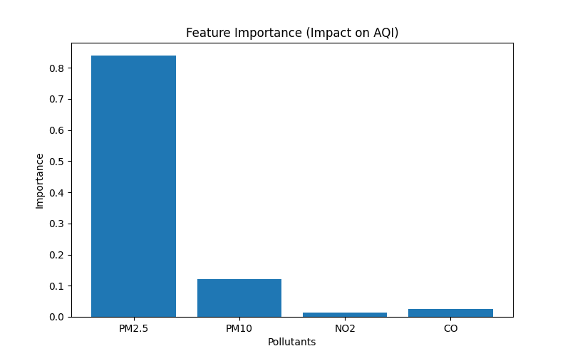
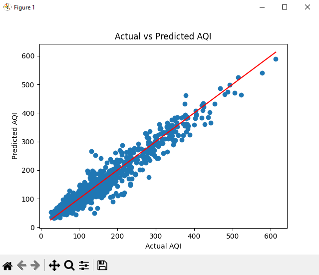

# AQI Prediction using Machine Learning

## Article

I’ve written a detailed breakdown of this project, including the problem, approach, and insights:

[https://medium.com/YOUR-ARTICLE-LINK](https://medium.com/@pradnyaa.j/can-ai-predict-air-pollution-before-it-becomes-dangerous-i-built-a-model-to-find-out-e52b6aaafe68) 

In the article, I cover:
- The motivation behind predicting air pollution  
- How the model was built step-by-step  
- Key insights from the data  
- Visualizations and results

Feel free to check it out :)

-----

## Overview
This project uses Machine Learning to predict the Air Quality Index (AQI) based on air pollution data.

The model learns relationships between pollutants like PM2.5, PM10, NO2, and CO to estimate AQI levels.

-----

## Objective
To build a predictive model that:
- Estimates AQI using historical pollution data
- Identifies which pollutants impact air quality the most

-----

## Tech Stack
- Python
- Pandas
- NumPy
- Scikit-learn
- Matplotlib

-----

## Dataset
- Source: https://www.kaggle.com/datasets/rohanrao/air-quality-data-in-india
- File used: `air_quality.csv`

The dataset contains:
- Pollution metrics (PM2.5, PM10, NO2, CO, etc.)
- AQI values
- City and date information

-----

## How It Works

### 1. Data Cleaning
- Removed missing values using `dropna()`

### 2. Feature Selection
- Inputs: PM2.5, PM10, NO2, CO  
- Output: AQI  

### 3. Model Used
- Random Forest Regressor  

### 4. Training
- 80% training data  
- 20% testing data  

-----

## Results

- Mean Absolute Error (MAE): **16.28**

On average, the model predicts AQI within ~16 units of the actual value.

-----

## Key Insights

- PM2.5 has the highest impact on AQI (~83%)  
- PM10 contributes moderately  
- NO2 and CO have smaller effects  

-----

## Feature Importance

The model also helps identify which pollutants have the greatest impact on AQI.

- PM2.5 dominates (~83%) the predictions, contributing the most to AQI levels, followed by PM10.  
- NO2 and CO have comparatively smaller effects.

This aligns with real-world research, where PM2.5 is known to be one of the most harmful pollutants affecting human health.

-----

## Visualization

Below is a comparison of Actual vs Predicted AQI:

-----

## Future Improvements

- Add more features like temperature and humidity  
- Use deep learning models  
- Build a real-time AQI prediction web app  
- Integrate satellite data for better predictions  

-----

## Acknowledgements

This project was built as part of a learning exercise by replicating existing machine learning approaches for AQI prediction.

Dataset source: Kaggle  
